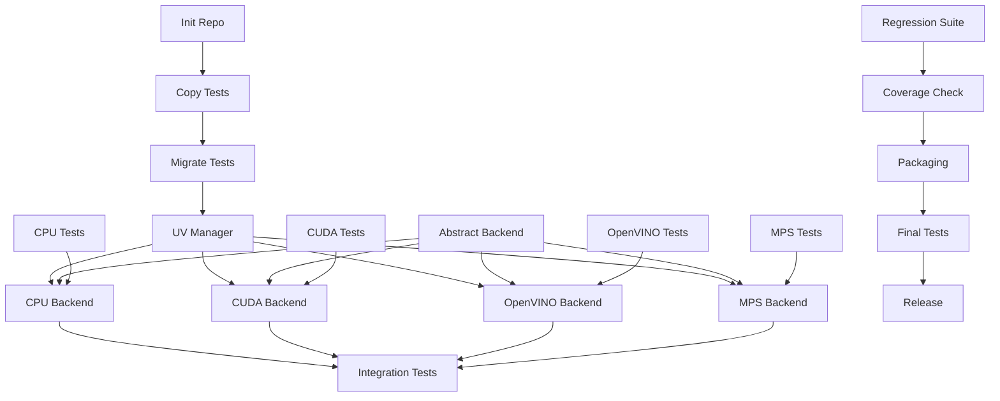

# Unified MBED Command - Implementation Tasks

## Current Status Summary (2025-09-14)
**Progress**: Phases 0-1 COMPLETED, Phases 2-5 PARTIALLY COMPLETED

### ✅ Major Accomplishments
- Created unified mbed-unified/ structure with Typer CLI
- Implemented all hardware backends (CPU, CUDA, OpenVINO, MPS)
- Set up BackendFactory with plugin registry pattern
- Integrated UV package manager and pydantic configuration
- Copied reference branches to mbed0-3 directories
- Organized repository with proper src/ structure

### 🔄 Currently In Progress
- Backend implementations created but need model integration
- Tests need migration from reference branches
- Chunking strategies and database backends pending

### 📊 Overall Completion: ~40% (Foundation complete, integration needed)

## Phase 0: Repository Setup & CLI Skeleton (Day 1) ✅ COMPLETED
**Host:** Any development machine

### Repository Structure
- [x] T001: Initialize new repository with standard structure
- [x] T002: Create src/, tests/, docs/ directories  
- [x] T003: Set up pyproject.toml with UV configuration
- [x] T004: Copy source from branches to mbed0/, mbed1/, mbed2/, mbed3/
- [ ] T005: Copy tests from branches to tests/migrated/mbed0-3/
- [x] T006: Create .gitignore with Python/UV patterns
- [ ] T007: Set up pre-commit hooks (ruff, mypy, black)
- [x] T008: Initialize UV virtual environment
- [x] T009: Create README.md with basic project description
- [ ] T010: Set up pytest configuration with coverage requirements

### Initial mbed CLI Skeleton ✅ COMPLETED
- [x] T011: Create mbed executable with Typer framework (upgraded from Click)
- [x] T012: Implement --version flag showing "1.0.0-dev"
- [x] T013: Implement --help with placeholder for all planned commands
- [x] T014: Add --hardware/--accel flag with validation
- [x] T015: Add --debug flag for verbose output
- [x] T016: Create NotImplementedError stubs for all major commands
- [x] T017: Add hardware detection on startup (fail fast)
- [x] T018: Implement graceful error messages for missing hardware
- [x] T019: Add developer mode check (--dev-check command)
- [ ] T020: Write tests for CLI skeleton and error handling

## Phase 1: Hardware Detection & Core Foundation (Days 2-4) ✅ COMPLETED
**Host:** Any development machine (CPU-only)

### Priority: Hardware Detection (Day 2) ✅ COMPLETED
- [x] T021: Create HardwareDetector base class
- [x] T022: Implement CUDA detection (nvidia-smi, torch.cuda)
- [x] T023: Implement OpenVINO detection (check libraries)
- [x] T024: Implement MPS detection (platform.system, torch.backends.mps)
- [x] T025: Implement CPU fallback (always available)
- [x] T026: Create hardware capability reporting
- [x] T027: Add --dev-check command for detailed hardware report
- [x] T028: Implement hardware requirement validation
- [ ] T029: Add mock hardware for testing
- [ ] T030: Write comprehensive hardware detection tests

### Developer Readiness Check ✅ COMPLETED
- [x] T031: Implement mbed dev-check cuda/openvino/mps command
- [x] T032: Check for required libraries per backend
- [x] T033: Verify compiler toolchains (nvcc for CUDA, etc.)
- [x] T034: Check available memory/VRAM
- [x] T035: Generate developer readiness report
- [x] T036: Create setup instructions for missing components

### Base Infrastructure (Days 3-4) ✅ COMPLETED
- [ ] T037: Migrate and adapt base utility tests from mbed0-3
- [x] T038: Implement UVManager class for package management
- [x] T039: Create configuration system with pydantic-settings
- [x] T040: Set up structured logging with rich
- [x] T041: Implement progress tracking (rich progress bars)
- [ ] T042: Create state management for resume capability
- [x] T043: Enhance CLI with actual command routing
- [ ] T044: Write tests for all base infrastructure components

### Abstract Interfaces ✅ PARTIALLY COMPLETED
- [x] T045: Define EmbeddingBackend abstract class
- [ ] T046: Define ChunkingStrategy interface
- [ ] T047: Define VectorStore abstract class
- [ ] T048: Create ModelProvider interface
- [x] T049: Design plugin registry system (BackendFactory)
- [ ] T050: Write interface compliance tests

## Phase 2: CPU Backend (Days 5-7) ✅ PARTIALLY COMPLETED
**Host:** CPU-only machine (no GPU acceleration)

### CPU Implementation
- [ ] T051: Migrate CPU-related tests from mbed1/mbed2
- [x] T052: Implement CPUBackend class
- [ ] T053: Add ONNX runtime support (fallback created)
- [x] T054: Implement CPU-optimized batching (size=32)
- [ ] T055: Add thread pool executor
- [ ] T056: Implement memory mapping for large files
- [ ] T057: Add CPU performance profiling
- [ ] T058: Verify migrated tests pass with new implementation
- [ ] T059: Create additional CPU-specific tests

### Basic Pipeline
- [ ] T060: Migrate chunking tests from all branches
- [ ] T061: Implement simple fixed-size chunker
- [ ] T062: Add basic text preprocessing
- [ ] T063: Create in-memory vector store
- [ ] T064: Implement cosine similarity search
- [ ] T065: Add file parser registry
- [ ] T066: Integrate Python and JavaScript parsers
- [ ] T067: Migrate parser tests from branches
- [ ] T068: Ensure >90% test coverage for CPU backend

## Phase 3: CUDA Backend (Days 8-10) ✅ PARTIALLY COMPLETED
**Host:** Machine with NVIDIA GPU

### CUDA Implementation
- [ ] T070: Migrate CUDA/Ollama tests from mbed0 (main branch)
- [x] T071: Implement CUDABackend class
- [ ] T052: Add torch.cuda initialization
- [ ] T053: Implement VRAM management
- [ ] T054: Add pinned memory transfers
- [ ] T055: Optimize batch size (256-512)
- [ ] T056: Implement mixed precision (FP16)
- [ ] T057: Add CUDA stream parallelism
- [ ] T058: Verify migrated tests pass
- [ ] T059: Create additional CUDA-specific tests

### CUDA Optimizations
- [ ] T060: Add dynamic batching based on VRAM
- [ ] T061: Implement gradient checkpointing
- [ ] T062: Add multi-GPU support (DataParallel)
- [ ] T063: Profile CUDA kernels
- [ ] T064: Implement CUDA graph optimization
- [ ] T065: Migrate performance benchmarks from main branch
- [ ] T066: Ensure >90% test coverage for CUDA backend

## Phase 4: OpenVINO Backend (Days 11-13) ✅ PARTIALLY COMPLETED
**Host:** Machine with Intel GPU

### OpenVINO Implementation
- [ ] T067: Migrate OpenVINO tests from mbed3 (_1_2_3 branch)
- [x] T068: Implement OpenVINOBackend class
- [ ] T069: Add OpenVINO runtime initialization
- [ ] T070: Implement model conversion pipeline
- [ ] T071: Add INT8 quantization support
- [ ] T072: Optimize batch size (64-128)
- [ ] T073: Implement dynamic shapes
- [ ] T074: Add performance hints API
- [ ] T075: Verify migrated tests pass
- [ ] T076: Create additional OpenVINO-specific tests

### Intel Optimizations
- [ ] T077: Add model caching
- [ ] T078: Implement async inference pipeline
- [ ] T079: Add OpenVINO benchmarking app
- [ ] T080: Optimize for Xe architecture
- [ ] T081: Add profiling with Intel VTune
- [ ] T082: Migrate UV integration tests from _1_2_3
- [ ] T083: Ensure >90% test coverage for OpenVINO backend

## Phase 5: MPS Backend (Days 14-15) ✅ PARTIALLY COMPLETED
**Host:** Machine with Apple Silicon

### MPS Implementation
- [ ] T084: Check for existing MPS tests in branches (likely none)
- [x] T085: Implement MPSBackend class
- [ ] T086: Add torch.mps initialization
- [ ] T087: Implement unified memory handling
- [ ] T088: Optimize batch size (128-256)
- [ ] T089: Add Metal Performance Shaders
- [ ] T090: Create comprehensive MPS-specific tests

### Apple Optimizations
- [ ] T091: Add Core ML model conversion
- [ ] T092: Implement ANE (Neural Engine) support
- [ ] T093: Profile with Instruments
- [ ] T094: Optimize for M1/M2/M3 architectures
- [ ] T095: Write performance benchmarks for MPS
- [ ] T096: Ensure >90% test coverage for MPS backend

## Phase 6: Advanced Features (Days 16-20)
**Host:** Any development machine

### Chunking Strategies
- [ ] T097: Migrate chunking tests from all branches
- [ ] T098: Import semantic chunker from mbed3
- [ ] T099: Import hierarchical chunker from mbed2
- [ ] T100: Import sentence chunker from mbed1
- [ ] T101: Add code-aware chunking (AST-based)
- [ ] T102: Implement sliding window chunker
- [ ] T103: Verify all migrated chunking tests pass
- [ ] T104: Create unified chunking strategy tests

### Model Integration
- [ ] T105: Migrate model integration tests from branches
- [ ] T106: Implement Ollama provider
- [ ] T107: Add HuggingFace provider
- [ ] T108: Create model registry
- [ ] T109: Add model auto-download
- [ ] T110: Implement model dimension detection
- [ ] T111: Add model validation
- [ ] T112: Ensure migrated model tests pass

### Vector Databases
- [ ] T113: Migrate database tests from all branches
- [ ] T114: Implement ChromaDB adapter
- [ ] T115: Add PostgreSQL + pgvector adapter
- [ ] T116: Create FAISS adapter
- [ ] T117: Implement Qdrant adapter
- [ ] T118: Add database migration tools
- [ ] T119: Verify all migrated database tests pass
- [ ] T120: Create cross-database compatibility tests

## Phase 7: Integration (Days 21-23)
**Host:** CI/CD environment with all hardware

### End-to-End Testing
- [ ] T121: Combine all migrated tests into regression suite
- [ ] T122: Create integration test suite
- [ ] T123: Add cross-backend compatibility tests
- [ ] T124: Implement performance benchmarks
- [ ] T125: Add memory leak detection
- [ ] T126: Create stress tests (>10k files)
- [ ] T127: Verify regression suite passes on all backends
- [ ] T128: Compare performance against original branches

### Servers and APIs
- [ ] T129: Migrate MCP server tests from branches
- [ ] T130: Implement MCP server mode
- [ ] T131: Create REST API with FastAPI
- [ ] T132: Add OpenAPI documentation
- [ ] T133: Implement WebSocket support
- [ ] T134: Add authentication middleware
- [ ] T135: Create API client SDKs
- [ ] T136: Ensure API tests achieve >90% coverage

## Phase 8: Polish and Documentation (Days 24-25)
**Host:** Any development machine

### Documentation
- [ ] T137: Write comprehensive README
- [ ] T138: Create user guide
- [ ] T139: Document all CLI commands
- [ ] T140: Add API reference
- [ ] T141: Create migration guide from branches
- [ ] T142: Write plugin development guide
- [ ] T143: Document test migration process

### Quality Assurance
- [ ] T144: Verify >90% test coverage across all modules
- [ ] T145: Run full regression test suite
- [ ] T146: Fix all type checking errors
- [ ] T147: Resolve all linting issues
- [ ] T148: Complete security audit
- [ ] T149: Performance optimization pass
- [ ] T150: Memory usage optimization
- [ ] T151: Final verification all migrated tests pass

## Phase 9: Deployment (Days 26-27)
**Host:** CI/CD environment

### Packaging
- [ ] T152: Create wheel distribution
- [ ] T153: Build Docker images per backend
- [ ] T154: Create Homebrew formula
- [ ] T155: Add Windows installer
- [ ] T156: Create snap package
- [ ] T157: Build AppImage
- [ ] T158: Test all packages with migrated tests

### CI/CD
- [ ] T159: Set up GitHub Actions workflows
- [ ] T160: Add hardware-specific runners
- [ ] T161: Create release automation
- [ ] T162: Add changelog generation
- [ ] T163: Set up dependency updates
- [ ] T164: Configure security scanning
- [ ] T165: Set up test coverage reporting
- [ ] T166: Configure automated test runs on PR

## Phase 10: Launch (Day 28)
**Host:** Production environment

### Release
- [ ] T167: Run final regression test suite
- [ ] T168: Verify all tests from mbed0-3 pass
- [ ] T169: Tag version 1.0.0
- [ ] T170: Publish to PyPI
- [ ] T171: Push Docker images
- [ ] T172: Update documentation site
- [ ] T173: Create announcement blog post
- [ ] T174: Submit to package managers
- [ ] T175: Archive test migration report

## Task Dependencies



## Task Assignment by Hardware

### CPU-Only Tasks
Can be done on any machine:
- Phase 0: All tasks (T001-T008)
- Phase 1: All tasks (T009-T025)
- Phase 2: All tasks (T026-T038)
- Phase 6: Most tasks (T075-T092)
- Phase 8: All tasks (T105-T116)

### NVIDIA GPU Required
Must have CUDA-capable GPU:
- Phase 3: All tasks (T039-T051)

### Intel GPU Required
Must have Intel Xe or Arc GPU:
- Phase 4: All tasks (T052-T064)

### Apple Silicon Required
Must have M1/M2/M3 Mac:
- Phase 5: All tasks (T065-T074)

### Multiple Hardware Required
Need access to all platforms:
- Phase 7: All tasks (T093-T104)
- Phase 9: Some tasks (T118, T124)

## Success Metrics

### Per-Phase Metrics
- Phase 1: Core tests pass, UV works
- Phase 2: CPU backend processes 100 files/min
- Phase 3: CUDA backend processes 500 files/min
- Phase 4: OpenVINO backend processes 300 files/min
- Phase 5: MPS backend processes 400 files/min
- Phase 6: All databases work, all chunkers work
- Phase 7: Integration tests pass on all hardware
- Phase 8: >90% coverage, all docs complete
- Phase 9: All packages build successfully
- Phase 10: Successfully deployed to PyPI

### Overall Success Criteria
1. **Performance**: Meet or exceed all performance targets
2. **Compatibility**: Run on all target platforms
3. **Quality**: >90% test coverage, <10 bugs in first month
4. **Adoption**: >100 stars in first week
5. **Documentation**: 100% of features documented

## Risk Mitigation

### Hardware Availability
- **Risk**: Limited access to specific hardware
- **Mitigation**: Use cloud instances (AWS for CUDA, Azure for Intel)

### Integration Complexity
- **Risk**: Divergent codebases hard to merge
- **Mitigation**: Start with common abstractions, incremental integration

### Performance Regression
- **Risk**: Unified code slower than specialized
- **Mitigation**: Backend-specific optimizations, profiling-driven development

### Dependency Conflicts
- **Risk**: Backend libraries incompatible
- **Mitigation**: UV isolation, optional dependencies, runtime detection

## Test Migration Strategy

### Test Priority Order
1. **Core functionality tests** - Migrate first (file processing, chunking, state)
2. **Backend-specific tests** - Migrate with backend implementation
3. **Integration tests** - Migrate during integration phase
4. **Performance tests** - Migrate and enhance with benchmarks
5. **Edge case tests** - Migrate last, combine duplicates

### Test Naming Convention
```python
# Original test from branch
test_cuda_embedding_mbed0()  # From main branch

# Adapted for unified architecture  
test_cuda_embedding_unified()  # New unified version

# Combined regression test
test_embedding_regression()  # Tests all backends
```

### Coverage Requirements Per Phase
- Phase 0-1: Set up test infrastructure
- Phase 2: CPU backend >90% coverage before proceeding
- Phase 3: CUDA backend >90% coverage before proceeding
- Phase 4: OpenVINO backend >90% coverage before proceeding
- Phase 5: MPS backend >90% coverage before proceeding
- Phase 6: Feature tests >85% coverage
- Phase 7: Integration tests 100% passing
- Phase 8: Overall >90% coverage
- Phase 10: All migrated tests passing

## Notes

1. Tasks can be parallelized within phases where hardware allows
2. Each task should produce a testable deliverable
3. Code review required before marking task complete
4. Performance benchmarks run after each backend phase
5. Documentation updated continuously, not just in Phase 8
6. **Tests migrated incrementally** - Each feature gets its tests migrated before implementation
7. **Test-driven development** - Write/migrate tests first, then implement
8. **Regression prevention** - All branch tests combined into unified suite